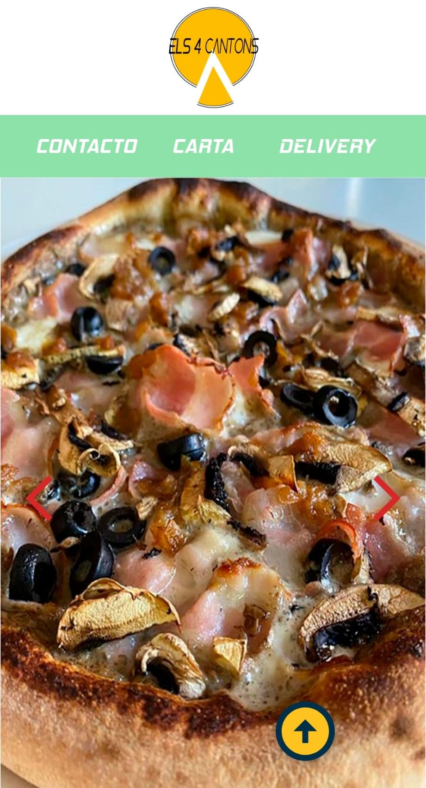
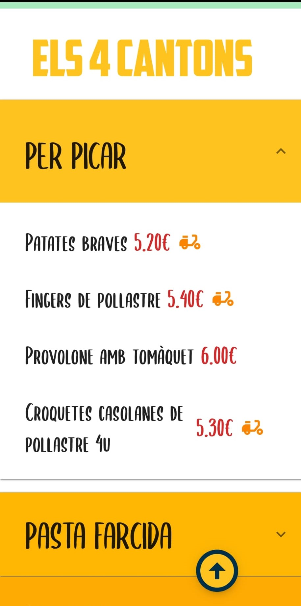
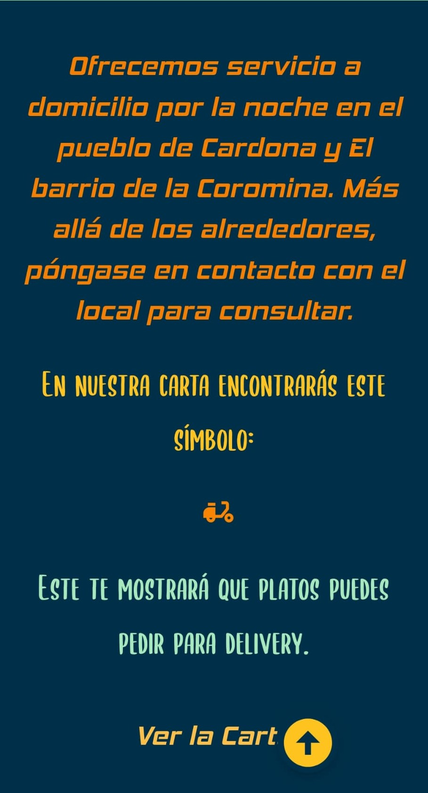
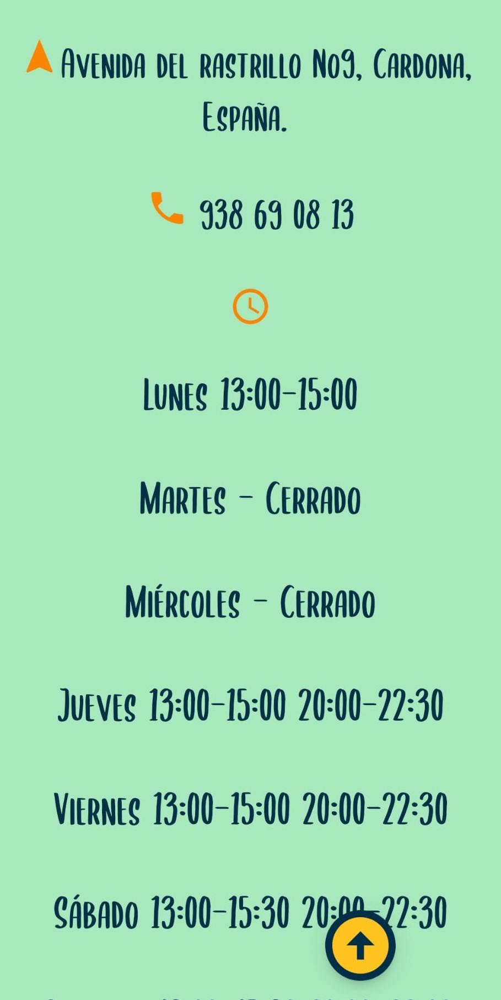

# Els 4 cantons

 

 
 

 

---

This project is made with [Create React App](https://github.com/facebook/create-react-app) and [Material UI](https://mui.com/) v5.10.15 .

 

---

## `Description`

Els 4 Cantons is a web page dedicated to a restaurant. In it we show the menu, the delivery and we facilitate the contact of the client.

Click here for view the deployed application -> https://elisabethmartinezmembrado.github.io/Els4Cantons/

---
## `Requirements` 
* NodeJS
* Npm
---

## `Views`

### `Home`

### `Menu`

### `Delivery`

### `Contacto`

---

## `Functions`

This application contains a function that creates the menus in a dynamic way, through arrays that contain objects. These are made up of each dish, ingredients, price and if it has delivery.

---
## `Instalation`

1 - Download the app on GitHub. For this we clone the project and copy the url of the project.

2 - From the console we open the project folder and with comand `npm instal`, we download the packages.

3- To the open local server, we type `npm start`.

---

## `CD (Continuous Deployment)`

The CI provider is GitHub Actions.
The project inlcudes a Pipeline in .yml format.

## `Upgrade ideas`

* Create an API to add the menu and make it easier to change it.

* Link some third-party backup application like the fork.

---

## `Licence`

Copyright 2022 Elisabeth Martinez Membrado.
Permission is hereby granted, free of charge, to any person obtaining a copy of this software and associated documentation files (the "Software"), to deal in the Software without restriction, including without limitation the rights to use, copy, modify, merge, publish, distribute, sublicense, and/or sell copies of the Software, and to permit persons to whom the Software is furnished to do so, subject to the following conditions:

The above copyright notice and this permission notice shall be included in all copies or substantial portions of the Software.

THE SOFTWARE IS PROVIDED "AS IS", WITHOUT WARRANTY OF ANY KIND, EXPRESS OR IMPLIED, INCLUDING BUT NOT LIMITED TO THE WARRANTIES OF MERCHANTABILITY, FITNESS FOR A PARTICULAR PURPOSE AND NONINFRINGEMENT. IN NO EVENT SHALL THE AUTHORS OR COPYRIGHT HOLDERS BE LIABLE FOR ANY CLAIM, DAMAGES OR OTHER LIABILITY, WHETHER IN AN ACTION OF CONTRACT, TORT OR OTHERWISE, ARISING FROM, OUT OF OR IN CONNECTION WITH THE SOFTWARE OR THE USE OR OTHER DEALINGS IN THE SOFTWARE.

